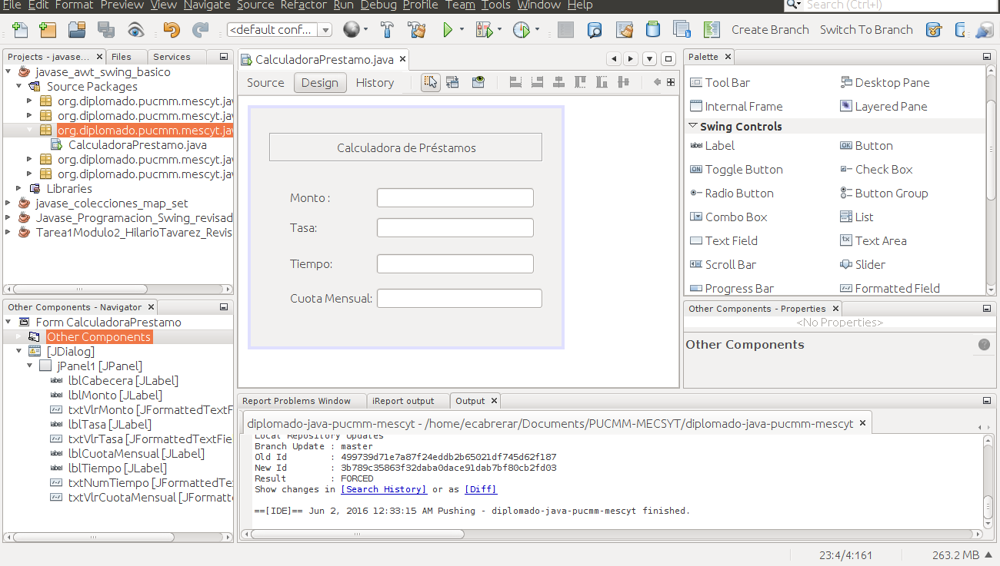
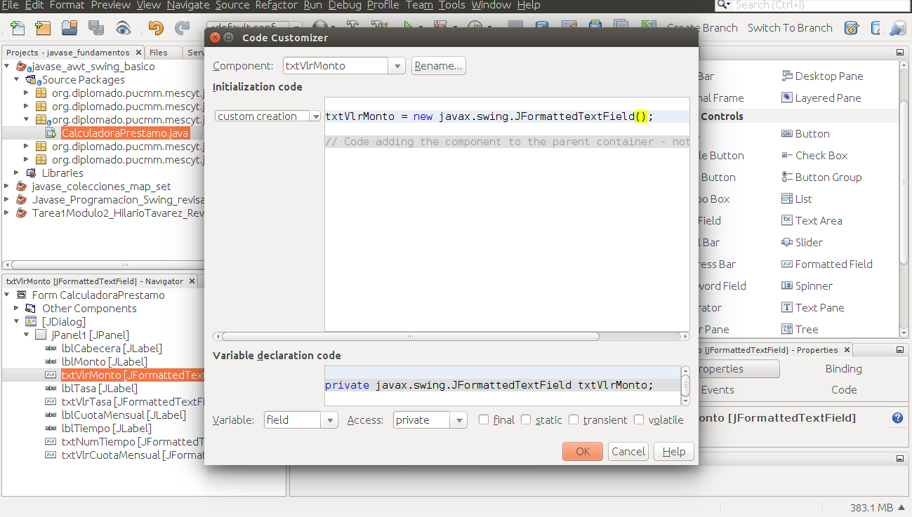
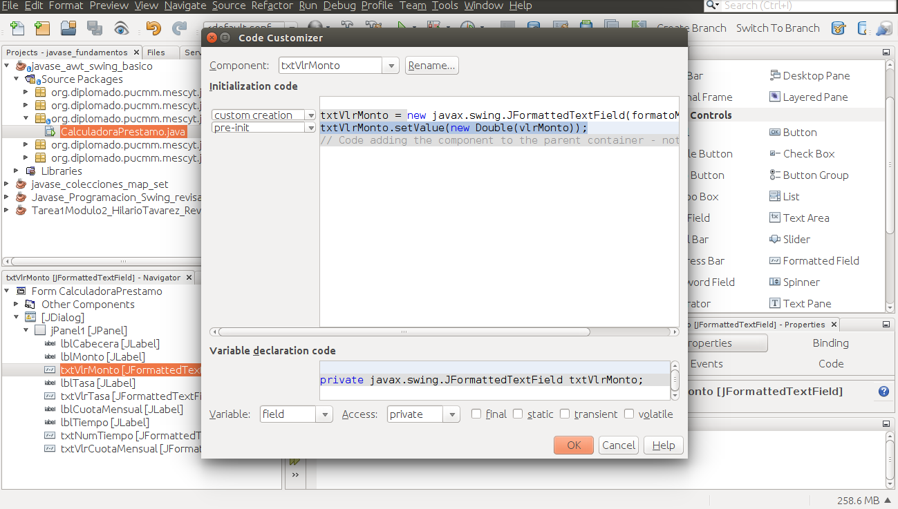

**Calculadora de Prestamo usando NumberFormat y Formatted Field**

Diseñar pantalla :

Agregar los componentes usando el diseñador que nos provee netbeans.



//Declaracion de formatos para formatear numeros
```java
	private NumberFormat formatoMonto;
	private NumberFormat formatoTasa;
	private NumberFormat formatoCuotaMensual;
```

Creamos valores por defecto

//Campos con valores iniciales
```java
	private double vlrMonto = 100000;
	private double vlrTasa = 7.0;  //7.5%
	private int numTiempo = 5;
	private double cuotaMensual;
```

//Creamos metodos para inicializar las anteriores
```java
 private void inicializarFormatos() {

    	formatoMonto = NumberFormat.getNumberInstance();

    	formatoTasa = NumberFormat.getNumberInstance();

    	formatoTasa.setMinimumFractionDigits(3);//Cantidad de dígitos con punto decimal mínimo

    	formatoCuotaMensual = NumberFormat.getCurrencyInstance();

 }
```
//Llamamos el método en el constructor para que las variables sean inicializados al momento de crear la instancia
```java
public CalculadoraPrestamo(java.awt.Frame parent, boolean modal) {

    	super(parent, modal);

    	inicializarFormatos();

    	cuotaMensual = calcularMontoCuota(vlrMonto, vlrTasa, numTiempo);

    	initComponents();

	}
```
Ahora debemos usar el editor.

Seleccionamos uno de los campos formateado y hacemos click derecho en dicho componente. Buscar la opción **Customize Code**.

Esto nos permitirá asignarle los formatos en el constructor de cada uno de los campos.

Seleccionamos el campo del Monto


```java
txtVlrMonto = new javax.swing.JFormattedTextField(formatoMonto);
txtVlrMonto.setValue(vlrMonto);
txtVlrMonto.setColumns(10);
```
Continuamos con el campo de la Tasa
```java
txtVlrTasa = new javax.swing.JFormattedTextField(formatoTasa);
txtVlrTasa.setValue(vlrTasa);
txtVlrTasa.setColumns(10);
```
Finalmente agregamos el formato al campo de la Cuota Mensual
```java
txtVlrCuotaMensual = new javax.swing.JFormattedTextField(formatoCuotaMensual);
txtVlrCuotaMensual.setColumns(10);
txtVlrCuotaMensual.setValue(cuotaMensual);
```
Cualquier monto que usted digite en uno de lo campo es valido, incluyendo texto, pero en caso de que sea texto el formato que le hemos asignado borra esos valores y vuelve al valor por defecto asignado.

Debemos asignarle un evento y seleccionamos **PropertyChange**.
```
txtVlrMonto.addPropertyChangeListener(new java.beans.PropertyChangeListener() {

        	public void propertyChange(java.beans.PropertyChangeEvent evt) {

            	txtVlrMontoPropertyChange(evt);

        	}

    	});

txtVlrTasa.addPropertyChangeListener(new java.beans.PropertyChangeListener() {

        	public void propertyChange(java.beans.PropertyChangeEvent evt) {

            	txtVlrTasaPropertyChange(evt);

        	}

    	});

 txtNumTiempo.addPropertyChangeListener(new java.beans.PropertyChangeListener() {

        	public void propertyChange(java.beans.PropertyChangeEvent evt) {

            	txtNumTiempoPropertyChange(evt);

        	}

    	});
```
Al pulsar enter o el campo perder el focus se actualiza este evento y con el los campos de la pantalla.
```java
private void txtVlrMontoPropertyChange(java.beans.PropertyChangeEvent evt) {                                  	 
    	// TODO add your handling code here:

    	vlrMonto = ((Number) txtVlrMonto.getValue()).doubleValue();
    	cuotaMensual = calcularMontoCuota(vlrMonto, vlrTasa, numTiempo);
    	txtVlrCuotaMensual.setValue(cuotaMensual);

	}                                     	 

	private void txtVlrTasaPropertyChange(java.beans.PropertyChangeEvent evt) {                                 	 
    	// TODO add your handling code here:

    	vlrTasa = ((Number) txtVlrTasa.getValue()).doubleValue();
    	cuotaMensual = calcularMontoCuota(vlrMonto, vlrTasa, numTiempo);
    	txtVlrCuotaMensual.setValue(cuotaMensual);

	}                                   	 

	private void txtNumTiempoPropertyChange(java.beans.PropertyChangeEvent evt) {                                       	 // TODO add your handling code here:

    	numTiempo = ((Number) txtNumTiempo.getValue()).intValue();
    	cuotaMensual = calcularMontoCuota(vlrMonto, vlrTasa, numTiempo);
    	txtVlrCuotaMensual.setValue(cuotaMensual);

	}                                     	 
```
