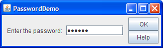

La clase **JPasswordField**, una subclase de JTextField, ofrece campos de texto especializados para la introducción de contraseña.

Por razones de seguridad, un campo de contraseña no muestra los caracteres que escribe el usuario. En cambio, el campo muestra un carácter diferente al digitado, tal como un asterisco **"*"**.



Como otra medida de seguridad, un campo de contraseña almacena su valor como un array de caracteres, en lugar de como una cadena.

Al igual que un campo de texto ordinario, un campo de contraseña dispara un evento action cuando el usuario indica que se ha completado la introducción de texto, por ejemplo, pulsando la tecla Enter.

Declaración de un campo **JPasswordField**
```java
JPasswordField jPasswordField1;
```

Inicialización
```java
jPasswordField1 = new JPasswordField();
```

Obtener el valor del digitado en el campo **JPasswordField**
```java
char[] password = jPasswordField1.getPassword();
```

Como comentamos más arriba, por razones de seguridad la contraseña  es almacenada como un array de caracteres, para convertir la contraseña en una cadena de texto, debemos hacer lo siguiente.
```java
String cadenaTexto = String.valueOf(password);
```
En algunas ocasiones necesitamos confirmar una contraseña y le pedimos al usuario que vuelva a digitar la contraseña.

Para realizar la confirmación, primero debemos agregar dos campos **JPasswordField, **el primero para capturar la contraseña y el segundo para confirmar.


```java
JPasswordField jPasswordField1 = new JPasswordField();

JPasswordField jPasswordField2 = new JPasswordField();
```
Luego para comparar la primera contraseña con la segunda, hacemos la siguiente comparación.

Obtenemos los valores digitados en cada uno de los campos **JPasswordField**

```java

char[] password = jPasswordField1.getPassword();

char[] password1 = jPasswordField2.getPassword();
```
    	

Comparar contraseña con la confirmación
```java
 if(Arrays.equals(password, password1)){

	//Lanzar mensajes si coinciden

 } else {

    //Lanzar mensaje si no coinciden

} 
```
