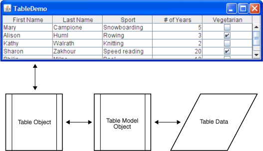

**Uso y Manejo de Table en Aplicaciones Swing**

Un **JTable** está  compuesto por 3 elementos , un objeto de la clase **Table**, un objeto **TableModel** y los datos . Es decir, que  **JTable** solamente sirve para mostrar los datos, pero realmente quien lo tiene es el **TableModel** y cualquier operación que se quiera realizar con los datos debe de ser a través del **TableModel**.  



Como hemos visto debemos de crear un TableModel para poder mostrar nuestros datos en la tabla.

Por  defecto un **JTable** tiene un TableModel que se llama **DefaultTableModel.**

Cuando usamos el editor de NetBeans este agrega automáticamente una instancia de la clase **DefaultTableModel **con algunas filas y columnas iniciales.

Si queremos tener más control sobre nuestra aplicación debemos crear nuestro propio **TableModel**.

Para a crear un TableModel, creamos una nueva clase Java y extender de la clase abstracta AbstractTableModel, la cual nos provee varios métodos necesarios para el TableModel.

Nuestra clase inicial :
```java
public class EjemploTableModel extends AbstractTableModel {

}
```
Luego implementamos los métodos que nos provee  AbstractTableModel :

**1- getRowCount()**:  debemos sobreescribirlo para que devuelva la cantidad de filas que tiene nuestro datos

**2- getColumnCount(): ** debemos sobreescribirlo para que devuelva la cantidad de columnas.

**3- getValueAt(int rowIndex, int columnIndex) :**  para mostrar los datos.

Necesitamos también sobreescribir el método  **getColumnName(int columnIndex) **para poder ponerle nombres personalizados a las columnas.

En el constructor de nuestro **TableModel** debemos de poner los nombres de las columnas.
```java
public EjemploTableModel(){

       columnas.add(0, "Codigo");

       columnas.add(1, "Nombre");

       columnas.add(2, "Direccion");

}
```
Antes de esto debemos de crear un List, que represente las columnas.

Para las columnas se puede utilizar un List o un arreglo.
```java
private List<String> columnas = new ArrayList<>();
```
Definición de un arreglo para las columnas.
```java
String[] columnas = {"Codigo","Nombre","Direccion"};
```
Otro List para los datos que vamos a mostrar:
```java
private List<T> dataArray; //donde T puede ser cualquier tipo de dato
```

```java
public class EjemploTableModel extends AbstractTableModel {

  private List<String> columnas = new ArrayList<String>();

  private List<ClaseEjemplo> dataArray;

	public EjemploTableModel(){

    	columnas.add(0, "Codigo");
    	columnas.add(1, "Nombre");
    	columnas.add(2, "Direccion");

    	dataArray = new ArrayList<>();
    	dataArray.add(new ClaseEjemplo(1,"Juan Perez","Santiago"));
	dataArray.add(new ClaseEjemplo(2,"Juana Peña","Santiago"));

	}

	@Override
        @Override
	public int getRowCount() {
	    	return dataArray.size(); /*Cantidad de filas que vamos a desplegar*/

	}

        @Override
	public int getColumnCount() {
	    return columnas.size(); /*Cantidad de columnas*/

	}

	@Override
	public String getColumnName(int columnIndex){
	   return (String) columnas.get(columnIndex);  /*Nombre de cada columna*/

	}

         @Override
	public Object getValueAt(int rowIndex, int columnIndex) {

  	ClaseEjemplo clase = (ClaseEjemplo) dataArray.get(rowIndex);

    	switch(columnIndex){

        	case 0:
            	return clase.getId();
        	case 1:
            	return clase.getNombre();

        	case 2:
            	return clase.getDireccion();
        	default:
            	return null;

    	}

	}

}
```
En el metodo **getValueAt(int rowIndex, int columnIndex)**  especificamos que valor vamos a mostrar en cada columnas .

Finalmente en el contructor del GUI donde vamos donde queremos usar el TableModel, le cargamos los datos al JTable:
```java
jTable1.setModel(new EjemploTableModel());
```

si queremos podemos crear un metodo para hacerlo mas elegante:
```java
private void setData(){
    	jTable1.setModel(new EjemploTableModel());
}
```
Lo Llamamos desde el contructor:
```java
  public FrmEjemplo() {

    	initComponents();
    	this.setData();

}
```
**Ejemplo:**

Tenemos una clase llamada Persona que contiene las propiedades  **nombre, apellido, genero y edad.**

La clase Persona se representa de la siguiente forma.

Queremos crear un TableModel para poder desplegar un listado de personas en un **JTable.**

Creamos una clase **Java **y asignamos el nombre de **TableModelPersona. **Debemos extender de la clase abstracta **AbstractTableModel.**

**Clase Inicial**
```java
/**
 *
 * @author ecabrerar
 */

public class TableModelPersona extends AbstractTableModel{


}    
```
Definimos un List para las columnas y otro List para los datos.
```java
private List<Persona> dataArray;
private List<String> columnas;
```
Como estamos extendiendo de AbstractTableModel debemos de implementar los metodos abstractos **getRowCount(),**
**getColumnCount() y getValueAt(int rowIndex, int columnIndex)**.

**Método getRowCount()**
```java
@Override
public int getRowCount() {
    return dataArray.size();

}
```
**Método getColumnCount()**
```java
	@Override
	public int getColumnCount() {
    	return columnas.size();

	}
```

**Método getValueAt(int rowIndex, int columnIndex)**
```java
@Override
public Object getValueAt(int rowIndex, int columnIndex) {

 	Persona p =   dataArray.get(rowIndex);

 	switch(columnIndex){
     	case 0:
		return  p.getNombre();

     	case 1:
        	return p.getApellido();

     	case 2:
         	return p.getEdad();

 	}

    	return null;

	}
```
En el constructor del **TableModel** inicializamos las listas.
```java
 public TableModelPersona() {

    	columnas = new ArrayList<>();
    	columnas.add("Nombre");
    	columnas.add("Apellido");
    	columnas.add("Edad");


   	dataArray = new ArrayList<>();

   	dataArray.add(new Persona("Juana", "Perez", Genero.FEMENINO, 37));
   	dataArray.add(new Persona("Rita", "Perez", Genero.FEMENINO, 15));
   	dataArray.add(new Persona("Maria", "Rosa", Genero.FEMENINO, 25));
   	dataArray.add(new Persona("Luz", "Santos", Genero.FEMENINO, 30));
   	dataArray.add(new Persona("Juan", "Perez", Genero.MASCULINO, 55));
   	dataArray.add(new Persona("Victor", "Martinez", Genero.MASCULINO, 32));

	}    
```
Poniendo todo junto
```java
/**
 *
 * @author ecabrerar
 */

public class TableModelPersona extends AbstractTableModel{

	private List<Persona> dataArray;
	private List<String> columnas;

	public TableModelPersona() {

    	columnas = new ArrayList<>();

    	columnas.add("Nombre");
    	columnas.add("Apellido");
    	columnas.add("Edad");


   	dataArray = new ArrayList<>();

   	dataArray.add(new Persona("Juana", "Perez", Genero.FEMENINO, 37));
   	dataArray.add(new Persona("Rita", "Perez", Genero.FEMENINO, 15));
   	dataArray.add(new Persona("Maria", "Rosa", Genero.FEMENINO, 25));
  	dataArray.add(new Persona("Luz", "Santos", Genero.FEMENINO, 30));
   	dataArray.add(new Persona("Juan", "Perez", Genero.MASCULINO, 55));
   	dataArray.add(new Persona("Victor", "Martinez", Genero.MASCULINO, 32));

	}    

    

	@Override
	public int getRowCount() {
	 	return dataArray.size();

	}

	@Override
	public String getColumnName(int column) {
	   	return columnas.get(column);

	}


	public Object getRow(int row ){
	    	return dataArray.get(row);

	}

	@Override
	public int getColumnCount() {
	    	return columnas.size();

	}

	@Override
	public Object getValueAt(int rowIndex, int columnIndex) {

	 	Persona p =   dataArray.get(rowIndex);
	
	switch(columnIndex){

     	case 0:
	       	return  p.getNombre();
     	case 1:
       		return p.getApellido();
     	case 2:
       		return p.getEdad();

 	}

    	return null;

	}

}
```
Si queremos asignarle nuestro **TableModelPersona** a un JTable cualquier debemos hacerlo en el constructor del componente principal donde está el JTable.

**Ejemplo** :
```java
public FrJTableBasico(java.awt.Frame parent, boolean modal) {
    	super(parent, modal);

    	initComponents();

    	jTable1.setModel(new TableModelPersona());

   }

```
