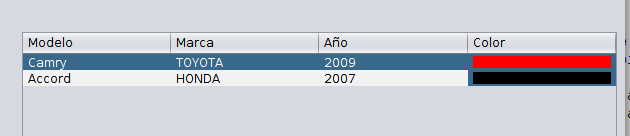
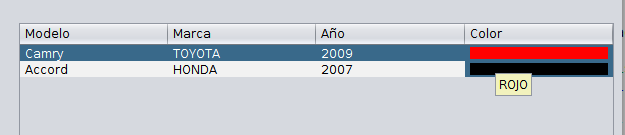

**Eventos de cambio de Datos**

Para manejar los eventos de cambio de datos se utiliza **TableModelEvent**. Trabajar directamente con dicha clase puede resultar un poco compleja, pero tiene la opción de utilizar **DefaultTableModel** donde ya se encuentra implementado.

Otra opción y es la recomendada, es crear nuestro TableModel a partir de la clase **AbstractTableModel**. Esta clase implementa un framework sencillo para la construcción de objetos **TableModelEvent**.

Simplemente necesita invocar uno de los siguientes métodos de la clase **AbstractTableModel**.

|||
|-----------------------|----------------------------------|
| fireTableCellUpdated  | Actualiza una celda en específico|
| fireTableRowsUpdated  | Actualiza filas en específico|
| fireTableDataChanged  | Actualiza la tabla completa (Sólamente datos)|
| fireTableRowsInserted | Nueva fila insertada |
| fireTableRowsDeleted  | Borrar filas existente |
| fireTableStructureChanged | Invalidar toda la tabla, los datos y la estructura|


Dentro de un **TableModel** cualquiera podemos sobre escribir el método **setValueAt(Object aValue, int rowIndex, int columnIndex)**

```java

    @Override
    public void setValueAt(Object aValue, int rowIndex, int columnIndex) {
    
        Auto auto = (Auto) aValue;        
        data.add(auto);   
     
        /**
         * Si usamos el metodo fireTableCellUpdated(rowIndex, columnIndex); 
         * tenemos que llamar el metodo tableChanged de la tabla que queremos asiganarle
         * el TableModel. Esto es jTable1.tableChanged(new TableModelEvent(jTable1.getModel())) ;
         * Si usamos fireTableDataChanged no es necesario llamar el metodo tableChanged porque este
         * ya lo implementa
         */
        fireTableDataChanged();
    
    }  


```


**Renderizadores (Renderers)**
Antes de trabajar con los renderizadores, es necesario entender cómo las tablas manejan sus celdas. Se podría esperar que cada celda de una tabla sea un componente. Sin embargo, por razones de rendimiento, los **JTables** son implementadas de forma diferente.


Para elegir el renderizador que muestra las celdas de una columna, una tabla determina en primer lugar si se ha especificado un renderizador para esa columna en particular. Si no lo hizo, entonces la tabla invoca el método **getColumnClass** del modelo de tabla, que recibe el tipo de datos de las celdas de las columnas. A continuación, la tabla compara tipo de datos de la columna con una lista de tipos de datos para los que se registraron los renderizadores de celdas.


Esta lista es inicializada por la tabla, pero se puede agregar o modificar. Actualmente, las tablas ponen los siguientes tipos de datos en la lista:


* Boolean — renderizado con un check box.
* Number — renderizado por un label alineado hacia la derecha.
* Double, Float — Igual que **Number**, pero la transformación entre el objeto y el texto se realiza mediante una instancia NumberFormat (utilizando el formato de número predeterminado para la localización actual).
*    Date — renderizado por un Label, con la transformación entre el objeto y el texto realizado por una instancia DateFormat (usando un estilo corto de la fecha y la hora).
*    ImageIcon, Icon — renderizado por un label alineado al centro.
*    Object — renderizado por un label que despliega el valor del objeto convertido a String.


Los editores de celdas son seleccionados usando el mismo algoritmo.


Para crear un renderizador para una celda debemos implementar la interfaz TableCellRenderer.

Ejemplo:
Deseamos crear un renderizador para una columna que muestra el color. Nuestro renderizador debe convertir los valores de la columna al color representado por el texto de la columna.

Tenemos un Enum que representa los colores disponibles.

```java
/**
 *
 * @author ecabrerar
 */
public enum Color {
    BLANCO,ROJO,NEGRO,GRIS;
}

```



Nuestro renderizador será una subclase de la clase JLabel y vamos a implementar la interfaz TableCellRenderer.

Clase inicial

```java

/**
 *
 * @author ecabrerar
 */
public class ColorTableRenderer extends JLabel implements TableCellRenderer {


 }
```

La interfaz TableCellRenderer nos obliga a implementar el método **getTableCellRendererComponent(JTable table, Object value, boolean isSelected, boolean hasFocus, int row, int column)**.

```java

public class ColorTableRenderer extends JLabel implements TableCellRenderer {

    @Override
    public Component getTableCellRendererComponent(JTable table, Object value, boolean isSelected, boolean hasFocus, int row, int column) {
	
    }

 }

``` 

Nos interesa saber tener la posibilidad de ponerle un border al JLabel, en el constructor recibimos como parámetro un tipo booleano para saber si le colocamos un border o no.

```java

 public ColorTableRenderer(boolean isBordered) {
        this.isBordered = isBordered;
        setOpaque(true);
    }

```

Tenemos que realizar una validación para el parámetro del border.

Si la variable del border es verdadero debemos validar que si tiene un border seleccionado, en caso de no tenerlo, debemos de crear uno.
Si la variable del border es falso debemos validar que si tiene un border seleccionado, en caso de no tenerlo, debemos de crear uno.

```java

if (isBordered) {
            if (selectedBorder == null) {
                selectedBorder = BorderFactory.createMatteBorder(2, 5, 2, 5, table.getSelectionBackground());
            }

            setBorder(selectedBorder);

        } else {
            if (unselectedBorder == null) {
                unselectedBorder = BorderFactory.createMatteBorder(2, 5, 2, 5, table.getBackground());
            }

            setBorder(unselectedBorder);
        }


```

También queremos mostrar un tool tip cuando el usuario posiciona el mouse encima de la celda del color.

```java

setToolTipText(color.name()); //Tooltip para la columna del color

```

Solamente nos resta convertir el texto de la columna en un color, crearemos el siguiente método para tales fines.

```java

 /**
     * Convertir el valor de la columna en texto a un objeto Color
     * @param color
     * @return 
     */
    private Color getColorFromText(org.diplomado.pucmm.mescyt.Color color) {

        switch (color) {
            case BLANCO:
                return Color.WHITE;
            case NEGRO:
                return Color.BLACK;
            case GRIS:
                return Color.GRAY;
            case ROJO:
                return Color.RED;
            default:
                return null;
        }
    }

```

Poniendo todo junto

```java
public class ColorTableRenderer extends JLabel implements TableCellRenderer {

    Border unselectedBorder = null;
    Border selectedBorder = null;
    boolean isBordered = true;

    public ColorTableRenderer(boolean isBordered) {
        this.isBordered = isBordered;
        setOpaque(true);
    }

    @Override
    public Component getTableCellRendererComponent(JTable table, Object value, boolean isSelected, boolean hasFocus, int row, int column) {

        
        org.diplomado.pucmm.mescyt.Color color = org.diplomado.pucmm.mescyt.Color.valueOf(value.toString());
                
        setToolTipText(color.name()); //Tooltip para la columna del color
        
        setBackground(getColorFromText(color));

        if (isBordered) {
            if (selectedBorder == null) {
                selectedBorder = BorderFactory.createMatteBorder(2, 5, 2, 5, table.getSelectionBackground());
            }

            setBorder(selectedBorder);

        } else {
            if (unselectedBorder == null) {
                unselectedBorder = BorderFactory.createMatteBorder(2, 5, 2, 5, table.getBackground());
            }

            setBorder(unselectedBorder);
        }

        return this;

    }

    /**
     * Convertir el valor de la columna en texto a un objeto Color
     * @param color
     * @return 
     */
    private Color getColorFromText(org.diplomado.pucmm.mescyt.Color color) {

        switch (color) {
            case BLANCO:
                return Color.WHITE;
            case NEGRO:
                return Color.BLACK;
            case GRIS:
                return Color.GRAY;
            case ROJO:
                return Color.RED;
            default:
                return null;
        }
    }

}

```

Para asignar el renderizador a la columna, hacer lo siguiente:
```java
 
        ColorTableRenderer colorRenderer = new ColorTableRenderer(true);
        jTable1.getColumnModel().getColumn(3).setCellRenderer(colorRenderer);
```

El ejemplo completo se encuentra en [javase_swing_jtable](javase_swing_jtable)
