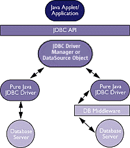
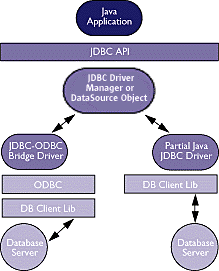
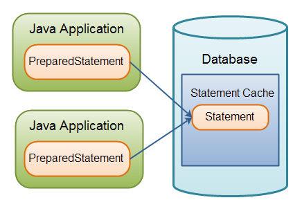

**Conectividad de Java a Base  de Datos(JDBC)**

*  Introducción a JDBC.
*  Selección y Configuración del Driver.
*  Creando una Conexión.
*  Uso de Statements y ResultSets.

**Introducción a JDBC:**

Java Database Connectivity, más conocida por sus siglas JDBC, es una API que permite la ejecución de operaciones sobre bases de datos desde el lenguaje de programación Java, independientemente del sistema operativo donde se ejecute o de la base de datos a la cual se accede, utilizando el dialecto SQL del modelo de base de datos que se utilice.

El API JDBC se presenta como una colección de interfaces Java y métodos de gestión de manejadores de conexión hacia cada modelo específico de base de datos.

Un manejador de conexiones hacia un modelo de base de datos en particular es un conjunto de clases que implementan las interfaces Java y que utilizan los métodos de registro para declarar los tipos de localizadores a base de datos (URL) que pueden manejar.

Para utilizar una base de datos particular, el usuario ejecuta su programa junto con la biblioteca de conexión apropiada al modelo de su base de datos, y accede a ella estableciendo una conexión, para ello provee el localizador a la base de datos y los parámetros de conexión específicos.

A partir de allí puede realizar con cualquier tipo de tareas con la base de datos a las que tenga permiso: consulta, actualización, creación, modificación y borrado de tablas, ejecución de procedimientos almacenados en la base de datos, etc.

**ARQUITECTURA JDBC**



**JDBC-ODBC Bridge plus ODBC Driver**



**Selección y Configuración del Driver**

Class.forName("Nombre del driver"); Con esta instrucción cargamos el driver de conexión a la base de datos en MySQL.  El driver debe de ser incluido con el classpath para poder ser usado en el proyecto.

//Carga dinámica del driver
```java

Class.forName("jdbc.DriverASCII");
```

**Creando una Conexión:**

Luego de cargar el Driver, es necesario crear la conexión a la base de datos.

Para ello usamos el método getConnection de la clase ***DriverManager*** (que implementa la clase Driver).

A dicho método le pasamos como parámetro una URL de conexión a la base de datos, que se compone, por lo general, de tres partes separados por ":", jdbc*:nombre_dbms:datos_de_conexion.*

Aunque esto depende del tipo de DMBS y conector que usemos. (Para más detalles de la URL, ver la documentación específica para el conector).

Este método además, devuelve un objeto Connection que usaremos para crear y ejecutar sentencias SQL, sobre la base de datos.

**DriverManager**

 static Connection getConnection(
                       String especBD,
                       String nombreUsuario,
                       String clave)

**Uso de Statements y ResultSets:**

**createStatement():** este método crea/devuelve un objeto Statement, con el cual podremos ejecutar sentencias en la base de datos.

**Statement**

void executeUpdate(String SQLupdateExpr)

ResultSet executeQuery(String SQLqueryExpr)

**ExecuteQuery():** este método sirve para ejecutar consultas sobre la base de datos (para inserción y modificación de datos usar **executeUpdate()**. Recibe como parametro una sentencia SQL, y devuelve un objeto ResultSet que contendrá los datos de la consulta.

**ResultSet** : Representa un conjunto de registros que se pueden modificar iterativamente

Bool next()
String getString(String nombreColumna)
Float getFloat (String nombreColumna)

Las excepciones que manejamos son básicamente: **ClassNotFoundException**, que se lanzará por lo general cuando el programa no encuentre el Driver. **SQLException**, que se lanzará cuando hayan errores a nivel de SQL (errores al insertar datos, errores de sintaxis en las consultas, etc.).

**Uso básico de JDBC**
```java

ClassforName("jdbc.DriverASCII");

Connection con =  DriverManager.getConnection( "jdbc:odbc:cuentas", "rmoriyon", "cursofse");

Statement stmt = con.createStatement();
```

**Uso básico de JDBC II**
```java

stmt.executeUpdate( "CREATE TABLE CUENTA (...)");

stmt.executeUpdate("INSERT INTO CUENTA (...)" + "VALUES (...)");

stmt.executeUpdate("UPDATE CUENTA ...");

stmt.executeUpdate( "DELETE FROM CUENTA ...");

ResultSet rs = stmt.executeQuery( "SELECT ... FROM CUENTA, ...");

while(rs.next()) {

 String nombre = rs.getString("nombre");

 Integer dni = rs.getInteger("dniCliente");

 Integer cc = rs.getInteger("numCuenta");

 Integer s = rs.getInteger("saldo");

System.out.println( nombre + "" + dni + "" + cc + "" + s); }

```

**JDBC: Transacciones**

```java

con.setAutoCommit(false);

stmt.execute...

if (s > 1000) con.commit();

else con.rollBack();

```

**PreparedStatement**

**PreparedStatement** es un tipo especial de objeto Statement con algunas características útiles.

Recuerde, usted necesita un objeto Statement con el fin de ejecutar, ya sea una consulta o una actualización. 
Puede utilizar un **PreparedStatement** en lugar de un **Statement** y beneficiarse de las características de la **PreparedStatement**.

**Principales Características:**

* Fácil de insertar parámetros en la instrucción SQL.
* Fácil de reutilizar el PreparedStatement con nuevos parámetros.
* Puede aumentar el rendimiento de las instrucciones ejecutadas.
* Activa las actualizaciones por lotes más fácil.

**Uso básico**

```java

String sql = "update personas set nombre=? , apellido=? where id=?";

PreparedStatement preparedStatement = 	connection.prepareStatement(sql);

preparedStatement.setString(1, "Pedro");

preparedStatement.setString(2, "Perez");

preparedStatement.setLong  (3, 123);

int resultado = preparedStatement.executeUpdate();
```

**Creando un PreparedStatement**

```java

String sql = "select * from personas where id=?";

PreparedStatement preparedStatement = connection.prepareStatement(sql);
```

**Inserción de parámetros en un PreparedStatement**

Cuando requiera insertar un parámetro en su SQL, se escribe un signo de interrogación (?).
```java
String sql = "select * from personas where id=?";
```
Una vez que se crea un **PreparedStatement** (preparado) para la instrucción SQL anterior, se puede insertar parámetros en el lugar del signo de interrogación. Esto se hace usando los muchos métodos **setXXX ()**.

**Ejemplo:**
```java

preparedStatement.setLong(1, 123);
```

El primer número (1) es el índice del parámetro para insertar el valor. El segundo número (123) es el valor para insertar en la instrucción SQL.

**Ejemplo detallado:**

```java
String sql = "select * from personas where id=?";

PreparedStatement preparedStatement = connection.prepareStatement(sql);

preparedStatement.setLong(123);

```

Usted puede tener más de un parámetro en una sentencia SQL. Sólo tiene que insertar más de un signo de interrogación. **Ejemplo:**

```java

String sql = "select * from personas where nombre=? and apellido=?";

```java

PreparedStatement preparedStatement = connection.prepareStatement(sql);

preparedStatement.setString(1, "Juan");
preparedStatement.setString(2, "Perez");

```

**Ejecución de PreparedStatement**

La ejecución de PreparedStatement se parece a la ejecución de una declaración normal. Para ejecutar una consulta, llame a **executeQuery ()** o el método **executeUpdate().**

**Ejemplo:**

```java

String sql = "select * from personas where nombre=? and apellido=?";

PreparedStatement preparedStatement = connection.prepareStatement(sql);

preparedStatement.setString(1, "Juan");
preparedStatement.setString(2, "Perez");

ResultSet result = preparedStatement.executeQuery();

```

Como se puede ver, el método **executeQuery()** devuelve un conjunto de resultados (ResultSet).

**Un Ejemplo con executeUpdate():**

```java

String sql = "update personas set nombre=? , apellido=? where id=?";

PreparedStatement preparedStatement = connection.prepareStatement(sql);
```

```java
String sql = "update personas set nombre=? , apellido=? where id=?";

PreparedStatement preparedStatement = 	connection.prepareStatement(sql);

preparedStatement.setString(1, "Pedro");
preparedStatement.setString(2, "Perez");
preparedStatement.setLong  (3, 123);

int filasModificadas = preparedStatement.executeUpdate();

```

El método **executeUpdate ()** se utiliza cuando se realiza una actualización de datos. Devuelve un entero que cuenta la cantidad de registros en la base de datos que se vieron afectados por la actualización.

**Reutilizando a PreparedStatement**

Una vez un **PreparedStatement** es preparada, se puede reutilizar después de la ejecución. Vuelve a utilizar un **PreparedStatement** mediante el establecimiento de nuevos valores para los parámetros y luego ejecutarlo nuevamente.

**Ejemplo:**

```java

String sql = "update personas set nombre=? , apellido=? where id=?";

PreparedStatement preparedStatement = 	connection.prepareStatement(sql);

preparedStatement.setString(1, "Pedro");
preparedStatement.setString(2, "Perez");
preparedStatement.setLong  (3, 123);

int filasModificadas = preparedStatement.executeUpdate();

preparedStatement.setString(1, "Juan");
preparedStatement.setString(2, "Perez");
preparedStatement.setLong  (3, 456);

int filasModificadas = preparedStatement.executeUpdate();

```

Esto funciona para ejecutar consultas también, usando el método executeQuery(), que devuelve un conjunto de resultados.

**Rendimiento:**

Se necesita tiempo para que una base de datos pueda analizar una cadena SQL, y crear un plan de consulta para ello. Un plan de consulta es un análisis de cómo la base de datos puede ejecutar la consulta de la manera más eficiente.

Si envía una nueva instrucción SQL completo para cada consulta o actualización de la base de datos, la base de datos tiene que analizar el código SQL para consultas y crear un plan de consulta. Mediante la reutilización de un PreparedStatement existente se puede reutilizar tanto el análisis sintáctico de SQL y el plan de consultas para consultas posteriores. Esto acelera la ejecución de la consulta, disminuyendo el análisis y la consulta de planificación de arriba de cada ejecución.

Hay dos niveles de reutilización potencial para un PreparedStatement.

* La reutilización de PreparedStatement por el controlador JDBC.
* La reutilización de PreparedStatement por la base de datos.

En primer lugar, el controlador JDBC puede almacenar en caché los objetos PreparedStatement internamente, y así reutilizar los objetos PreparedStatement. Esto puede ahorrar un poco de la hora de creación PreparedStatement.

En segundo lugar, el plan de análisis y consulta en caché potencialmente podría reutilizar en aplicaciones Java, por ejemplo, servidores de aplicaciones en un cluster, utilizando la misma base de datos.



Gráfico cortesía de [http://tutorials.jenkov.com/](http://tutorials.jenkov.com/)

Puede seguir investigando en [http://tutorials.jenkov.com/jdbc/preparedstatement.html](http://tutorials.jenkov.com/jdbc/preparedstatement.html)

