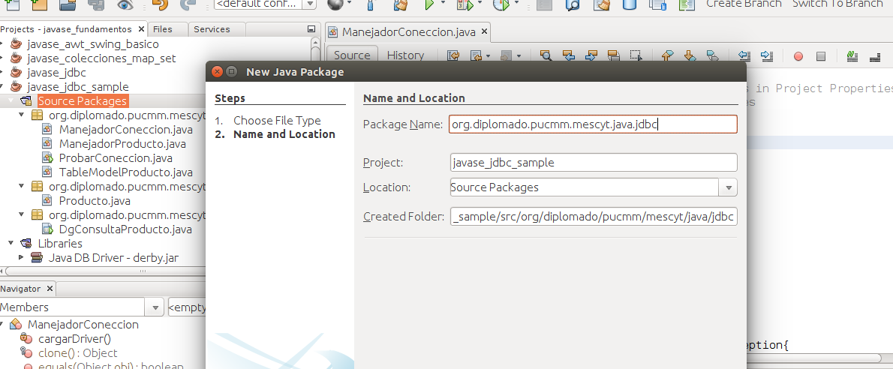

###Consulta Básica Usando JDBC y DerbyDB###
  

En la clase anterior  aprendimos como realizar aplicaciones cliente servidor usando conectividad de Java a Base de Datos(JDBC).

*En resumen, nos conectamos a la base de datos ***_Derby DB embebida_*** en Java y nos conectamos a la base de datos de prueba ***_sample_*** que está incluida en NetBeans.*

*Luego de realizar la consulta en la base de datos desplegamos el contenido en un JTable.*

A continuación vamos a describir cada uno de los pasos que hicimos para realizar dicho ejemplo.

Crear un nuevo proyecto y llamarlo **javase_jdbc_sample**


A continuación debemos crear un paquete con la estructura **org.diplomado.pucmm.mescyt.java.jdbc**

Para crear el paquete, click derecho encima de Source Packages → new Java Package



Es importante recordar que java utiliza una API que permite la ejecución de operaciones sobre bases de datos desde el lenguaje de programación Java, independientemente del sistema operativo donde se ejecute o de la base de datos a la cual se accede, utilizando el dialecto SQL del modelo de base de datos que se utilice, el es llamado  JDBC.  

El API JDBC se presenta como una colección de interfaces Java y métodos de gestión de manejadores de conexión hacia cada modelo específico de base de datos. 

Netbeans trae consigo una base de datos llamada **JavaDB o derby** como se le conocía anteriormente, por razones de tiempo vamos a utilizar una base de datos de prueba que trae JavaDB.

La base de datos se llama **sample** y tiene como usuario y clave a **app** para conectarse a la misma. Debemos de especificar el puerto, el cual es** 1527**.

Podemos verla en la pestaña de **Services->Databases** e iniciamos la base de datos y podemos ver las  tablas que tiene samples.

 

Ahora  debemos  seleccionar el **driver** que vamos a usar en la conección y luego lo configuramos.

Agregamos el driver a nuestro proyecto, click derecho sobre **Libraries->add Library ****→**** Java DB driver **


Luego de agregado el driver su proyecto debe quedar así.


Para manejar la conección vamos a crear una clase llamada **ManejadorConeccion** y creamos un método llamado **cargarDriver()** donde especificaremos que driver vamos a utilizar .

```java

Class.forName("Nombre del driver"); 
```

Con esta instrucción cargamos el driver de conexión a la base  de datos.

Nuestro método quedaría de la siguiente forma:

```java
private void cargarDriver() throws ClassNotFoundException{

    	Class.forName("org.apache.derby.jdbc.ClientDriver"); //Cargando el Driver de Derby DB

	}

``` 

**org.apache.derby.jdbc.ClientDriver** es el nombre del driver que vamos a utilizar para conectarnos a Java DB o derby. Lanzamos  la excepción generada en caso que no se encuentre la clase al momento de cargarla.

Luego de cargar el Driver, es necesario crear la conexión a la base de datos. 

Para ello usamos el método getConnection de la clase DriverManager (que implementa la clase  Driver). 

A dicho método le pasamos como parámetro una URL de conexión a la base de datos, que se  compone, por lo general, de tres partes separados por ":", **jdbc:nombre_dbms:datos_de_conexion**

Aunque esto depende del tipo de DMBS y conector que usemos. 

Este método además, devuelve un objeto Connection que usaremos para crear y ejecutar sentencias SQL, sobre la base de datos.


Ahora vamos a crear un método llamado **getConeccion()** que devuelve un tipo de dato **Connection** del paquete **java.sql.Connection** para manejar nuestra coneccion.

```java
  public Connection getConeccion() throws SQLException{

    	try {

        	cargarDriver();

    	} catch (ClassNotFoundException ex) {

        	Logger.getLogger(ManejadorConeccion.class.getName()).log(Level.SEVERE, null, ex);

    	}
  	 

    	//String de coneccion

    	String url = "jdbc:derby://localhost:1527/sample";
    	String usuario = "app";
    	String clave = "app";

   	Connection  con = DriverManager.getConnection(url, usuario, clave);

    	return con;

	}
```

jdbc:derby://localhost:1527/sample es la URL de la base de datos (jdbc:nombre_dbms:datos_de_conexion) 

**app** es el usuario y **app** es la clave, estos valores pudieron haberse pasado por variables.

Ya tenemos la coneccion a la base de datos ahora necesitamos especificar de donde vamos a tomar los datos, y elegimos la tabla **PRODUCT** de la base de datos **sample**.

Cada fila de la tabla **Product** representa los datos de un producto en específico, por eso debemos de crear una Clase llamada **Producto** para encapsular cada fila como un objeto tipo product.

Creamos nuestra clase Producto . 

De cada **Producto** nos interesa saber  el **id, **descripción**  y **cantidad**. Creamos los métodos **setter y getter** utilizando cualquiera de las técnicas que hemos visto en ocasiones anteriores.

Nuestra clase queda de la siguiente forma:

```java
package org.diplomado.pucmm.mescyt.java.jdbc.encapsulados;

/**

 *

 * @author ecabrerar

 */

public class Producto {

	private int id;

	private String descripcion;

	private int cantidad;

	public Producto(int id, String descripcion, int cantidad) {

    	this.id = id;

    	this.descripcion = descripcion;

    	this.cantidad = cantidad;

	}

	public int getId() {

    	return id;

	}

	public void setId(int id) {

    	this.id = id;

	}

	public String getDescripcion() {

    	return descripcion;

	}

	public void setDescripcion(String descripcion) {

    	this.descripcion = descripcion;

	}

	public int getCantidad() {

    	return cantidad;

	}

	public void setCantidad(int cantidad) {

    	this.cantidad = cantidad;

	}

}
```

Necesitamos ahora crear una Clase que represente la operaciones que podemos realizar sobre la tabla Product. La nueva clase se llamará **ManejadorProducto** y creamos un 

 método que nos permita extraer los datos desde la tabla **Product**, debemos de retornar los datos en un List, la cual va a contener objetos del tipo producto.

Creamos el método y le ponemos el nombre de **getListadoProducto** y queda de la siguiente manera:

```java
public List<Producto> getListadoProducto() {

    	List<Producto> productos = new ArrayList<>();

    	try {

        	ManejadorConeccion con = new ManejadorConeccion();

        	Connection coneccion = con.getConeccion();

        	try (Statement stmt = coneccion.createStatement()) {

            	try (ResultSet rs = stmt.executeQuery("select * from Product")) {

                	while (rs.next()) {

                    	Producto p = new Producto(rs.getInt("PRODUCT_ID"),

                            	rs.getString("DESCRIPTION"),
                            	rs.getInt("QUANTITY_ON_HAND"));

                    	productos.add(p);

                	}

            	}

        	} finally {

            	coneccion.close(); //Cerrar coneccion manualmente

        	}

    	} catch (SQLException ex) {

        	Logger.getLogger(ManejadorProducto.class.getName()).log(Level.SEVERE, null, ex);

    	}

    	return productos;

	}
```

Ahora debemos de crear un GUI para mostrar nuestros datos, creamos una nueva clase . 

Creamos un JDialog con el nombre de **DgConsultaProducto**

No voy a abundar mucho en como hacer el GUI, simplemente agregamos un panel encima del área de diseño y un Jtable, nuestro GUI quedará de la siguiente forma:


Un **JTable** está  compuesto por 3 elementos , un objeto de la clase Table, un objeto TableModel y los datos . Es decir, que  jTable solamente sirve para mostrar los datos, pero realmente quien lo tiene es el TableModel y cualquier operación que se quiera realizar con los datos debe de ser a través del TableModel.  

Como hemos visto debemos de crear un TableModel para poder mostrar nuestros datos en la tabla, por  defecto un JTable tiene un tablemodel que se llama **DefaultTableModel** que es instanciado automáticamente cuando no se le pasa un TableModel.

Vamos a crear nuestro **TableModel**, creamos una clase Java y la llamamos  **TableModelProducto**. Nuestra clase debe implementar la interfaz **AbstractTableModel**, la cual nos provee varios métodos necesarios para el TableModel.

Nuestra clase inicial :

public class **TableModelProducto** extends AbstractTableModel {

}

Luego implementamos los métodos que nos provee  AbstractTableModel :

**1- getRowCount():**  debemos sobreescribirlo para que devuelva la cantidad de filas que tiene nuestro datos 

**2- getColumnCount():**  debemos sobreescribirlo para que devuelva la cantidad de columnas.

**3- getValueAt(int rowIndex, int columnIndex) :**  para mostrar los datos.

Necesitamos también sobreescribir el método  **getColumnName(int columnIndex)** para poder ponerle nombres personalizados a las columnas.

Definiendo las columnas 
```java

  String[] columnas = {"Id", "Descripcion", "Cantidad"}; //Columnas.
```

Recordar que puede ser un arreglo o una implementación de  List.

Creamos List para los datos que vamos a mostrar:

```java
 private List<Producto> data;
```

y en constructor le cargamos los datos al tablemodel de la siguiente manera:

```java

 public TableModelProducto() {

    	ManejadorProducto mProducto = new ManejadorProducto();
    	data = mProducto.getListadoProducto();  //Cargando los datos

}
```

El **TableModelProducto** quedará de la siguiente forma:

```java
public class TableModelProducto extends AbstractTableModel {

	String[] columnas = {"Id", "Descripcion", "Cantidad"}; //Columnas

	private List<Producto> data;

	public TableModelProducto() {

    	ManejadorProducto mProducto = new ManejadorProducto();

    	data = mProducto.getListadoProducto();  //Cargando los datos

	}

	@Override

	public int getRowCount() {

    	return data.size();

	}

	@Override

	public String getColumnName(int column) {

    	return columnas[column];

	}

	@Override

	public int getColumnCount() {

    	return columnas.length;

	}

	@Override

	public Object getValueAt(int rowIndex, int columnIndex) {

    	Producto p = data.get(rowIndex);

    	switch (columnIndex) {

        	case 0:
            	return p.getId();
        	case 1:
            	return p.getDescripcion();
        	case 2:
            	return p.getCantidad();
        	default:
            	return null;

    	}

	}

}

```

En el método **getValueAt(int rowIndex, int columnIndex)** especificamos que valor vamos a mostrar en cada columnas .

Finalmente en el constructor de nuestro GUI, le cargamos los datos al JTable:

```java

    	TableModelProducto tmproducto = new TableModelProducto();
    	jTable1.setModel(tmproducto);
```
Si queremos podemos crear un método para hacerlo más elegante:

```java
private void setData(){

     TableModelProducto tmproducto = new TableModelProducto();
    	jTable1.setModel(tmproducto);

 }
```

Lo Llamamos desde el constructor:
```java

public DgConsultaProducto(java.awt.Frame parent, boolean modal) {
        initComponents();
        this.setData();
     }
```

Como ejercicio de práctica puede realizar las siguientes modificaciones.

1. Centrar la pantalla
2. Especificar un título para la barra de titulo
3. No permitir que la pantalla cambie de tamaño.

Si eres de los que llegaste hasta el final de este ejercicio y asume el reto de agregar las modificaciones anteriores, espero que publique un post en el grupo del diplomado explicando como hiciste tu solución. 

**_No esperes a que otro la publique, ser usted el primero en publicarla._**

