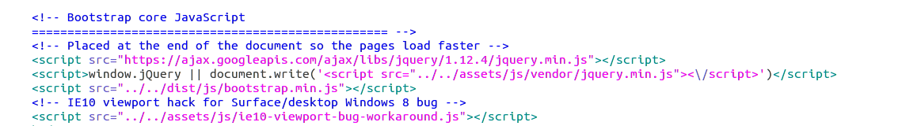
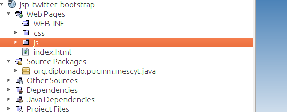

**Twitter Boostrap (HTML5 y CSS3)**

**Twitter Bootstrap** es un framework o conjunto de herramientas de código abierto para diseño de sitios y aplicaciones web. Contiene plantillas de diseño con tipografía, formularios, botones, cuadros, menús de navegación y otros elementos de diseño basado en HTML y CSS, así como, extensiones de JavaScript opcionales adicionales.

Bootstrap fue desarrollado por **Mark Otto** y **Jacbod Thornton** de Twitter, como un marco de trabajo (framework) para fomentar la consistencia a través de herramientas internas.

Bootstrap tiene un soporte relativamente incompleto para [HTML5](http://www.w3schools.com/html/default.asp) y [CSS 3](http://www.w3schools.com/css/default.asp) , pero es compatible con la mayoría de los navegadores web. La información básica de compatibilidad de sitios web o aplicaciones está disponible para todos los dispositivos y navegadores. Existe un concepto de compatibilidad parcial que hace disponible la información básica de un sitio web para todos los dispositivos y navegadores.

Más información en [https://es.wikipedia.org/wiki/Twitter_Bootstrap](https://es.wikipedia.org/wiki/Twitter_Bootstrap), [http://getbootstrap.com](http://getbootstrap.com) y [http://www.w3schools.com/bootstrap/default.asp](http://www.w3schools.com/bootstrap/default.asp).

En adición a los elementos regulares de HTML, Bootstrap contiene otra interfaz de elementos comúnmente usados. Ésta incluye botones con características avanzadas (e.g grupo de botones o botones con opción de menú desplegable, listas de navegación, etiquetas horizontales y verticales, ruta de navegación, paginación, etc.), etiquetas, capacidades avanzadas de miniaturas tipográficas, formatos para mensajes de alerta y barras de progreso.

Puedes empezar con una plantilla [HTML básica](https://getbootstrap.com/getting-started/#template)  o modifica uno de los [ejemplos](https://getbootstrap.com/getting-started/#examples)  que ya están disponibles. Todos los ejemplos están disponibles en el repositorio principal [https://github.com/twbs/bootstrap](https://github.com/twbs/bootstrap), en la siguiente ruta **docs/examples**.

**Integración de Twitter Boostrap (HTML5 y CSS3) con JSP**

Para nuestro caso de estudio vamos a utilizar el ejemplo **jumbotron** [https://getbootstrap.com/examples/jumbotron/](https://getbootstrap.com/examples/jumbotron/). 

Descargamos dicho ejemplo siguiendo los pasos mencionados en el párrafo anterior.


Abrimos el archivo **index.html** para determinar cuáles archivos e imágenes está utilizando la plantilla.




Nos damos cuenta que está usando varios archivos **css** y **javascript**, por lo tanto, estos deben ser copiados a nuestro proyecto Java Web. 

La plantilla indica donde están ubicados estos archivos, en nuestro proyecto java web, crearemos dos directorios, uno llamado **css**, para las hojas de estilo y otro **js**, para los archivos javascript. 




También debemos copiar el directorio fonts que se encuentra dentro del archivo bootstrap que descargamos, en la ruta **docs/dist**.

La ventaja de utilizar una plantilla es que nos permite aplicar el mismo estilo a todas las páginas que vamos a utilizar dentro del proyecto. Incluso, pudiéramos tener, una plantilla para las páginas públicas y otra para las páginas con acceso restringido.

Para utilizar nuestra plantilla **jumbotron** debemos identificar la parte que puede ser reutilizable por varias páginas.


En esta imagen mostramos la parte de la plantilla que no es reutilizable, al momento de implementar la plantilla debemos borrar esa parte, es decir, el contenido que está dentro de la etiqueta  **<div class="container"></div>**  y utilizar el área que no está sombreada.

Para reutilizar una plantilla en jsp vamos a crear un directorio llamado **tags** dentro del directorio **WEB-INF**. A nuestra plantilla le voy a llamar **jumbotron-layout.tag**. Puede ser otro nombre pero debe tener la extensión **.tag** .

Creamos un nuevo archivo **New > Other > Empty File**, colocamos el nombre **jumbotron-layout.tag** y guardamos en **WEB-INF/tags.**

Debemos copiar en el archivo **jumbotron-layout.tag** el contenido que es reutilizable del archivo **index.html** que es reutilizable.

Luego de eso se debe cambiar la ruta de los archivos **css** y **javascript**.

**Archivos que están en el header**
```html
 <!-- Bootstrap core CSS -->

<link href="css/bootstrap.min.css" rel="stylesheet">

<!-- IE10 viewport hack for Surface/desktop Windows 8 bug -->

<link href="css/ie10-viewport-bug-workaround.css" rel="stylesheet">

<!-- Custom styles for this template -->

<link href="css/jumbotron.css" rel="stylesheet">

<!-- Just for debugging purposes. Don't actually copy these 2 lines! -->

<!--[if lt IE 9]><script src="js/ie8-responsive-file-warning.js"></script><![endif]-->

<script src="js/ie-emulation-modes-warning.js"></script>

```

**Archivos en el footer**
```html
<script>window.jQuery || document.write('<script src="js/vendor/jquery.min.js"><\/script>')</script>

<script src="js/bootstrap.min.js"></script>

<!-- IE10 viewport hack for Surface/desktop Windows 8 bug -->

<script src="js/ie10-viewport-bug-workaround.js"></script>
```

Ahora vamos a personalizar la plantilla usando etiquetas [JSTL](JSTL.md) agregando las siguientes expresiones:
```html
<%@attribute name="title" required="false" %>
<%@ attribute name="mainBody"  required="true" fragment="true" %>
<%@ taglib uri="http://java.sun.com/jsp/jstl/core" prefix="c" %>
```

**title** un atributo que representa el título mostrado que se mostrará en cada página. Está marcado que opcional **(required="false")**, que quiere decir, que no es obligatorio llenar este atributo.

**mainBody** un atributo que representa el contenido específico de cada página que implemente nuestra plantilla.
```html
<div class="container">

  	<jsp:invoke fragment="mainBody" />

  	<hr>

  <footer>

    	<p>&copy; 2016 Company, Inc.</p>

  </footer>

</div> <!-- /container -->
```
El código anterior indica donde será insertado el contenido del atributo **mainBody**.

Poniendo todo junto

```html
<%@attribute name="title" required="false" %>
<%@ attribute name="mainBody"             required="true" fragment="true" %>
<%@ taglib uri="http://java.sun.com/jsp/jstl/core" prefix="c" %>
<!DOCTYPE html>
<html lang="en">
  <head>
    <meta charset="utf-8">
    <meta http-equiv="X-UA-Compatible" content="IE=edge">
    <meta name="viewport" content="width=device-width, initial-scale=1">
    <!-- The above 3 meta tags *must* come first in the head; any other head content must come *after* these tags -->
    <meta name="description" content="">
    <meta name="author" content="">
    <link rel="icon" href="../../favicon.ico">

    <title>Jumbotron Template for Bootstrap <c:out value="${!empty title ? title : ''}"/></title>

    <!-- Bootstrap core CSS -->
    <link href="css/bootstrap.min.css" rel="stylesheet">

    <!-- IE10 viewport hack for Surface/desktop Windows 8 bug -->
    <link href="css/ie10-viewport-bug-workaround.css" rel="stylesheet">

    <!-- Custom styles for this template -->
    <link href="css/jumbotron.css" rel="stylesheet">

    <!-- Just for debugging purposes. Don't actually copy these 2 lines! -->
    <!--[if lt IE 9]><script src="js/ie8-responsive-file-warning.js"></script><![endif]-->
    <script src="js/ie-emulation-modes-warning.js"></script>

    <!-- HTML5 shim and Respond.js for IE8 support of HTML5 elements and media queries -->
    <!--[if lt IE 9]>
      <script src="https://oss.maxcdn.com/html5shiv/3.7.3/html5shiv.min.js"></script>
      <script src="https://oss.maxcdn.com/respond/1.4.2/respond.min.js"></script>
    <![endif]-->
  </head>

  <body>

    <nav class="navbar navbar-inverse navbar-fixed-top">
      <div class="container">
        <div class="navbar-header">
          <button type="button" class="navbar-toggle collapsed" data-toggle="collapse" data-target="#navbar" aria-expanded="false" aria-controls="navbar">
            <span class="sr-only">Toggle navigation</span>
            <span class="icon-bar"></span>
            <span class="icon-bar"></span>
            <span class="icon-bar"></span>
          </button>
          <a class="navbar-brand" href="#">Project name</a>
        </div>
        <div id="navbar" class="navbar-collapse collapse">
          <form class="navbar-form navbar-right">
            <div class="form-group">
              <input type="text" placeholder="Email" class="form-control">
            </div>
            <div class="form-group">
              <input type="password" placeholder="Password" class="form-control">
            </div>
            <button type="submit" class="btn btn-success">Sign in</button>
          </form>
        </div><!--/.navbar-collapse -->
      </div>
    </nav>

    <!-- Main jumbotron for a primary marketing message or call to action -->
    <div class="jumbotron">
      <div class="container">
        <h1>Hello, world!</h1>
        <p>This is a template for a simple marketing or informational website. It includes a large callout called a jumbotron and three supporting pieces of content. Use it as a starting point to create something more unique.</p>
        <p><a class="btn btn-primary btn-lg" href="#" role="button">Learn more &raquo;</a></p>
      </div>
    </div>
 
    <div class="container">
      <jsp:invoke fragment="mainBody" />

      <hr>

      <footer>
        <p>&copy; 2016 Company, Inc.</p>
      </footer>
    </div> <!-- /container -->


    <!-- Bootstrap core JavaScript
    ================================================== -->
    <!-- Placed at the end of the document so the pages load faster -->
    <script src="https://ajax.googleapis.com/ajax/libs/jquery/1.12.4/jquery.min.js"></script>
    <script>window.jQuery || document.write('<script src="js/vendor/jquery.min.js"><\/script>')</script>
    <script src="js/bootstrap.min.js"></script>
    <!-- IE10 viewport hack for Surface/desktop Windows 8 bug -->
    <script src="js/ie10-viewport-bug-workaround.js"></script>
  </body>
</html>
```
Ahora solo resta implementar nuestra plantilla, crear un archivo **index.jsp**.

En la primera línea debe aparecer la siguiente expresión.
```html
<%@ taglib prefix="pantilla" tagdir="/WEB-INF/tags" %>
<%@ taglib prefix="c" uri="http://java.sun.com/jsp/jstl/core"%>
```
El **prefijo** puede ser una lista cualquiera.

Implementación básica de la plantilla en **index.jsp.**
```html
<%@ taglib prefix="pantilla" tagdir="/WEB-INF/tags" %>

<%@ taglib prefix="c" uri="http://java.sun.com/jsp/jstl/core"%>

<pantilla:jumbotron-layout title=" Portada">

	<jsp:attribute  name="mainBody">

   	</jsp:attribute>

</pantilla:jumbotron-layout>
```

Dentro del atributo **mainBody** debe ir el contenido que queremos mostrar.

Ejemplo:
```html
<jsp:attribute  name="mainBody">

  	<!-- Example row of columns -->

  	<div class="row">

    	<div class="col-md-4">

      	<h2>Heading</h2>

      	<p>Donec id elit non mi porta gravida at eget metus. Fusce dapibus, tellus ac cursus commodo, tortor mauris condimentum nibh, ut fermentum massa justo sit amet risus. Etiam porta sem malesuada magna mollis euismod. Donec sed odio dui. </p>

      	<p><a class="btn btn-default" href="#" role="button">View details &raquo;</a></p>

    	</div>

    	<div class="col-md-4">

      	<h2>Heading</h2>

      	<p>Donec id elit non mi porta gravida at eget metus. Fusce dapibus, tellus ac cursus commodo, tortor mauris condimentum nibh, ut fermentum massa justo sit amet risus. Etiam porta sem malesuada magna mollis euismod. Donec sed odio dui. </p>

      	<p><a class="btn btn-default" href="#" role="button">View details &raquo;</a></p>

   	</div>

    	<div class="col-md-4">

      	<h2>Heading</h2>

      	<p>Donec sed odio dui. Cras justo odio, dapibus ac facilisis in, egestas eget quam. Vestibulum id ligula porta felis euismod semper. Fusce dapibus, tellus ac cursus commodo, tortor mauris condimentum nibh, ut fermentum massa justo sit amet risus.</p>

      	<p><a class="btn btn-default" href="#" role="button">View details &raquo;</a></p>

    	</div>

  	</div>

</jsp:attribute>
```
Para correr el ejemplo, clic derecho encima del proyecto, luego la opción Run. Asegurarse que el servidor tomcat esté encendido a la hora de darle a correr. Url para acceder al ejemplo[http://localhost:8084/jsp-twitter-bootstrap/](http://localhost:8084/jsp-twitter-bootstrap/) . Sustituir el puerto mostrado por el puerto definido en su máquina.


Para mayor información sobre el ejemplo anterior descargar y abrir el proyecto  [jsp-twitter-bootstrap](jsp-twitter-bootstrap)
