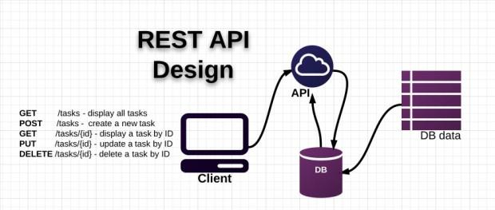

**Introducción a los Servicios Web**

**Wikipedia:**

*Un servicio web (en inglés, Web service) es una pieza de software que utiliza un conjunto de protocolos y estándares que sirven para intercambiar datos entre aplicaciones.*

*Distintas aplicaciones de software desarrolladas en lenguajes de programación diferentes, y ejecutadas sobre cualquier plataforma, pueden utilizar los servicios web para intercambiar datos en redes de ordenadores como Internet.*

La interoperabilidad se consigue mediante la adopción de estándares abiertos. Las organizaciones OASIS y W3C son los comités responsables de la arquitectura y reglamentación de los servicios Web.

Para mejorar la interoperabilidad entre distintas implementaciones de servicios Web se ha creado el organismo WS-I, encargado de desarrollar diversos perfiles para definir de manera más exhaustiva estos estándares.

Para mejorar la interoperabilidad entre distintas implementaciones de servicios Web se ha creado el organismo WS-I, encargado de desarrollar diversos perfiles para definir de manera más exhaustiva estos estándares.

**Enlaces:**

[https://es.wikipedia.org/wiki/OASIS_%28organizaci%C3%B3n%29](https://es.wikipedia.org/wiki/OASIS_%28organizaci%C3%B3n%29) 

[https://es.wikipedia.org/wiki/World_Wide_Web_Consortium](https://es.wikipedia.org/wiki/World_Wide_Web_Consortium) 

**Estándares empleados**

**Web Services Protocol Stack:** Así se denomina al conjunto de servicios y protocolos de los servicios Web.

**XML (Extensible Markup Language):** Es el formato estándar para los datos que se vayan a intercambiar.

**SOAP (Simple Object Access Protocol) o XML-RPC (XML Remote Procedure Call):** Protocolos sobre los que se establece el intercambio.

Otros protocolos: los datos en XML también pueden enviarse de una aplicación a otra mediante protocolos normales como HTTP (Hypertext Transfer Protocol), FTP (File Transfer Protocol), o SMTP (Simple Mail Transfer Protocol).

**WSDL (Web Services Description Language):** Es el lenguaje de la interfaz pública para los servicios Web. Es una descripción basada en XML de los requisitos funcionales necesarios para establecer una comunicación con los servicios Web.

**UDDI (Universal Description, Discovery and Integration):** Protocolo para publicar la información de los servicios Web. Permite comprobar qué servicios web están disponibles.

**WS-Security (Web Service Security):** Protocolo de seguridad aceptado como estándar por OASIS (Organization for the Advancement of Structured Information Standards). Garantiza la autenticación de los actores y la confidencialidad de los mensajes enviados.

**REST (Representational State Transfer):** arquitectura que, haciendo uso del protocolo HTTP, proporciona una API que utiliza cada uno de sus métodos (GET, POST, PUT, DELETE, etc) para poder realizar diferentes operaciones entre la aplicación que ofrece el servicio web y el cliente.

**Inconvenientes de los servicios Web**

Para realizar transacciones no pueden compararse en su grado de desarrollo con los estándares abiertos de computación distribuida como **CORBA (Common Object Request Broker Architecture)**.

Su rendimiento es bajo si se compara con otros modelos de computación distribuida, tales como **RMI (Remote Method Invocation)**, **CORBA** o **DCOM** (Distributed Component Object Model).

Al apoyarse en HTTP, pueden esquivar medidas de seguridad basadas en firewall cuyas reglas tratan de bloquear o auditar la comunicación entre programas a ambos lados de la barrera.

**Ventajas de los servicios web**

Aportan interoperabilidad entre aplicaciones de software independientemente de sus propiedades o de las plataformas sobre las que se instalen.

Los servicios Web fomentan los estándares y protocolos basados en texto, que hacen más fácil acceder a su contenido y entender su funcionamiento.

Permiten que servicios y software de diferentes compañías ubicadas en diferentes lugares geográficos puedan ser combinados fácilmente para proveer servicios integrados.

**Razones para crear servicios Web**

La principal razón para usar servicios Web es que se pueden utilizar con HTTP sobre TCP (Transmission Control Protocol) en el puerto 80.

**Servicios Web REST**

Roy Thomas Fielding en su tesis doctoral, Estilos Arquitecturales y el Diseño de Arquitecturas de Software basadas en Red, describe Representational State Transfer (REST) como un enfoque para desarrollar servicios web y una alternativa a otras especificaciones de computación distribuida tales como CORBA o DCOM.

**Enlaces:**

[http://www.ics.uci.edu/~fielding/pubs/dissertation/top.htm](http://www.ics.uci.edu/~fielding/pubs/dissertation/top.htm) 

[https://en.wikipedia.org/wiki/Roy_Fielding](https://en.wikipedia.org/wiki/Roy_Fielding) 

[https://www.ics.uci.edu/~fielding/pubs/dissertation/rest_arch_style.htm](https://www.ics.uci.edu/~fielding/pubs/dissertation/rest_arch_style.htm) 

En resumen se trata de:

* Arquitectura de sistema distribuido sobre el protocolo HTTP.

* Protocolo cliente / servidor sin estado.

* Operaciones definidas, GET, POST, PUT y DELETE soportando un CRUD.

* Identificador único para los recursos (URI).

* Estándar Flexible

* Servicio web sobre HTTP representado con JSON.

