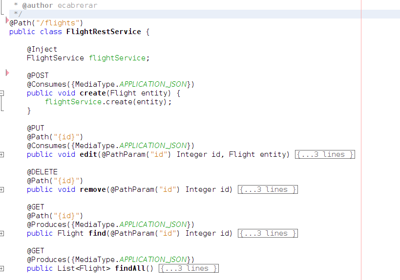
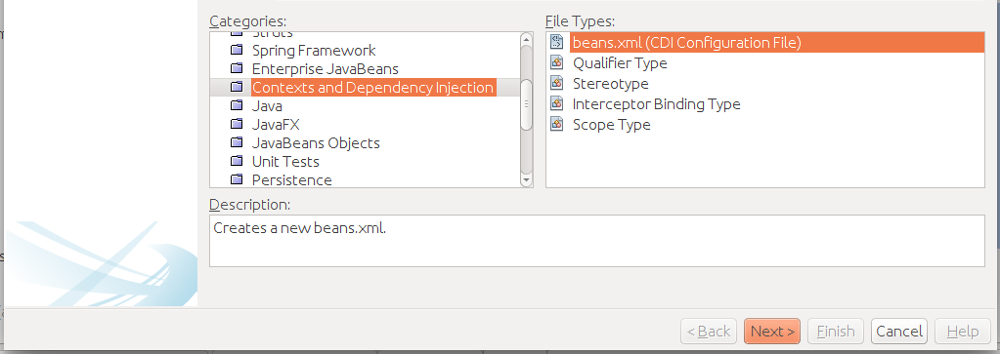

**JAX-RS**

* API de Java para crear servicios web REST

* JAX-RS 1.0 fue liberada en el 2008 para la versión Java EE 6 bajo la especificación JSR-311

* Simplifica el proceso de creación de servicios Web mediante Plain Old Java Objects (POJOS) y anotaciones.

* Mapea las peticiones HTTP con invocaciones de método Java

* Incluye anotaciones para implementar servicios Web: **@Path, @Get, @Put, @Post, @Delete,@PathParam, @QueryParam @Produces, @Consumes,** entre otros.

**Ejemplo Clase JAX-RS**



**¿Qué hay de nuevo en Java EE 7?**

**Java API for RESTful Web Services 2.0 (JSR 339) / JAX-RS 2.0:**

* Introduce elementos que ayudan a la productividad.

* Simplifica el API

* Incluye los siguientes aspectos:

    * API para el Cliente

    * Llamadas Asincrónicas vía Http

    * Filtros e interceptores

**Creando un servicio REST en Java**

Asegurarse tener la dependencia de Java EE 7 en el pom.xml del proyecto.
```xml
  <dependency>

        	<groupId>javax</groupId>

        	<artifactId>javaee-web-api</artifactId>

        	<version>7.0</version>

        	<scope>provided</scope>

  </dependency>
```
Queremos de crear un servicios de nombre **ServicioRestPais** y será expuesto usando la url **/paises.**

```java

/**
 *
 * @author ecabrerar
 */

@Path("/paises")
public class ServicioRestPais {

}
```

Inicialmente vamos a crear una lista estática de países que representará nuestra fuente de datos.
```java

	private List<Pais> getPaises(){

	    	List<Pais> lista = new ArrayList<>();

	    	lista.add(new Pais(1, "Republica Dominicana"));

	    	lista.add(new Pais(2, "Venezuela"));

	    	lista.add(new Pais(3, "Nicaragua"));

	    	lista.add(new Pais(4, "Uruguay"));

	    	lista.add(new Pais(5, "Haiti"));

   	 

    	return lista;

	}
```
Queremos crear un método que nos permite consultar todos los países.

```java

        @GET
	@Path("/static")
	@Produces({MediaType.APPLICATION_JSON})
	public List<Pais> consultarTodas(){ 

   		return getPaises();

	}
```
**/static** representa el punto de acceso para el método que acabamos de crear.

**@GET** indica que estaremos usando el método GET del protocolo http para realizar la consulta

**@Produces({MediaType.APPLICATION_JSON})** Indica que el resultado sera en formato JSON.

Para consultar un solo registro, creamos el siguiente método.

```java

        @GET
	@Path("/static/{id}")
	@Produces({MediaType.APPLICATION_JSON})
	public Pais consultarPorId(@PathParam("id") int id){

    		List<Pais> lista = getPaises(); 

	    	if(id < lista.size()){
			return lista.get(id);

	    	}else {
			return null;

	    	} 

	}
```
**@Path("/static/{id}")  {id}**  indica que el url estara acompañado con un parámetro llamado **id**.
**@PathParam("id") int id** Indica el nombre y el tipo de dato del parámetro.

**Todo junto**

```java

import java.util.ArrayList;
import java.util.List;
import javax.ws.rs.Consumes;
import javax.ws.rs.GET;
import javax.ws.rs.Path;
import javax.ws.rs.PathParam;
import javax.ws.rs.Produces;
import javax.ws.rs.core.MediaType;
import org.diplomado.pucmm.mescyt.java.petcareapp.javaee.entidades.Pais;
import org.diplomado.pucmm.mescyt.java.petcareapp.javaee.servicios.ServicioPais;
/**
 *
 * @author ecabrerar
 */

@Path("/paises")
public class ServicioRestPais {

	@GET
	@Path("/static")
	@Produces({MediaType.APPLICATION_JSON})
	public List<Pais> consultarTodas(){ 
   		return getPaises();

	}

	@GET
	@Path("/static/{id}")
	@Produces({MediaType.APPLICATION_JSON})
	public Pais consultarPorId(@PathParam("id") int id){

    		List<Pais> lista = getPaises();

	    	if(id < lista.size()){
			return lista.get(id);
	    	}else {
			return null;

	    	} 

     }
    

     private List<Pais> getPaises(){

    	List<Pais> lista = new ArrayList<>();

    	lista.add(new Pais(1, "Republica Dominicana"));

    	lista.add(new Pais(2, "Venezuela"));

    	lista.add(new Pais(3, "Nicaragua"));

    	lista.add(new Pais(4, "Uruguay"));

       return lista;

	} 

}
```
Para activar nuestro webservice rest, necesitamos crear una clase que extienda de **javax.ws.rs.core.Application** e indicar la ruta base de los servicios usando la anotación **javax.ws.rs.ApplicationPath.**

```java
import javax.ws.rs.ApplicationPath;
import javax.ws.rs.core.Application;

/**
 *
 * @author ecabrerar
 */

@ApplicationPath("rest")
public class RestConfig extends Application{ 


    
}

```

También necesitamos crear un archivo **beans.xml** para activar CDI en nuestro proyecto.

**beans.xml** es el archivo de configuración de CDI.

**New > Other > Contexts and Dependency Injection > beans.xml**.



Dicho archivo debe ser colocado en el directorio **WEB-INF**.

Contenido del archivo
```xml
<?xml version="1.0" encoding="UTF-8"?>

<beans xmlns="http://xmlns.jcp.org/xml/ns/javaee"

   	xmlns:xsi="http://www.w3.org/2001/XMLSchema-instance"

   	xsi:schemaLocation="http://xmlns.jcp.org/xml/ns/javaee http://xmlns.jcp.org/xml/ns/javaee/beans_1_1.xsd"

   	bean-discovery-mode="all">

</beans>
```
El ejemplo completo se encuentra en **programacion-web-java/labs/lab03**, con el nombre **petcareapp­javaee7.**

Descargar el proyecto y abrir en netbeans.

Para correr el ejemplo, clic derecho encima del proyecto, luego la opción Run. Asegurarse que el servidor glassfish esté encendido a la hora de darle a correr. Url para acceder al ejemplo 

[http://localhost:8080/jsp-twitter-bootstrap/](http://localhost:8080/jsp-twitter-bootstrap/)

Para acceder a nuestro servicio

[http://localhost:8080/jsp-twitter-bootstrap/rest/paises/static](http://localhost:8080/jsp-twitter-bootstrap/rest/paises/static)      Consultar todos

[http://localhost:8080/jsp-twitter-bootstrap/rest/paises/static/2](http://localhost:8080/jsp-twitter-bootstrap/rest/paises/static/2)   Consultar el pais con id 2.

